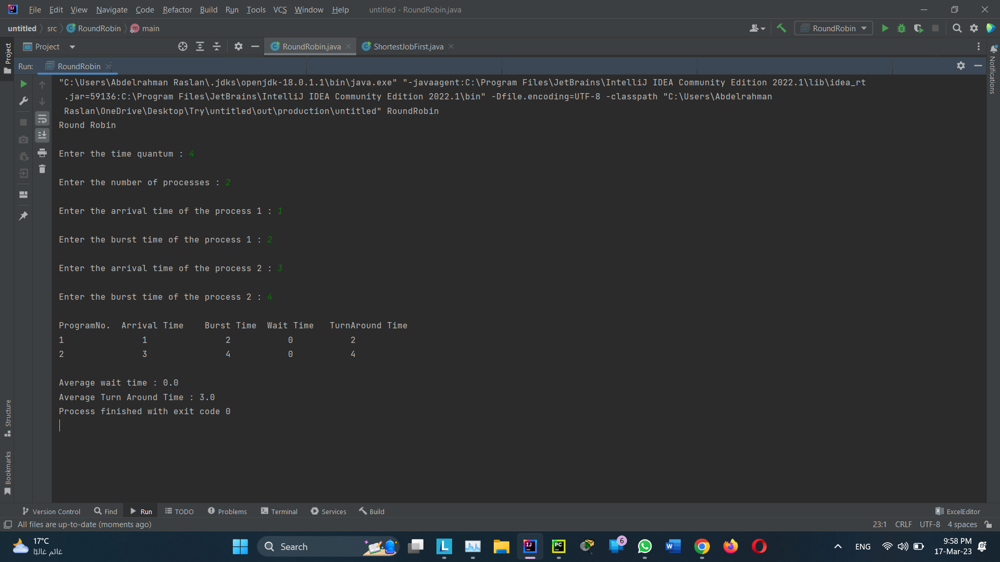
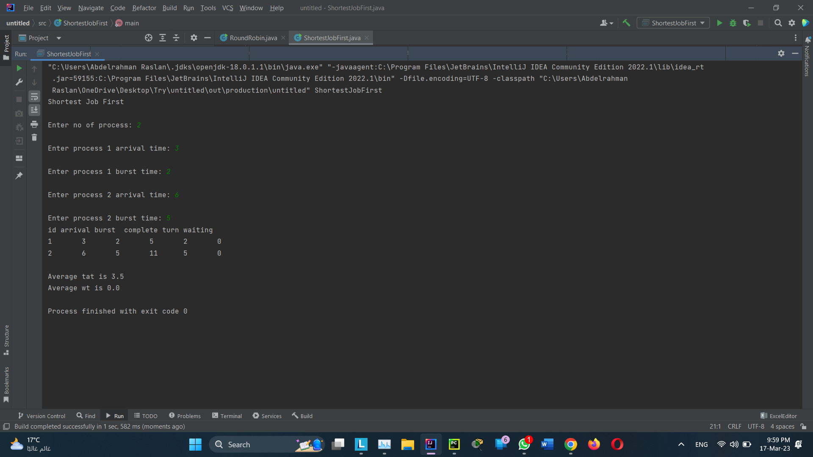

# SJF-RR-implement

## Round Robin scheduling algorithm 
Is one of the most popular scheduling algorithm which can actually be implemented in most of the operating systems. This is the preemptive version of first come first serve scheduling. The Algorithm focuses on Time Sharing. In this algorithm, every process gets executed in a cyclic way.

## Shortest Job First (SJF)
Is an algorithm in which the process having the smallest execution time is chosen for the next execution. This scheduling method can be preemptive or non-preemptive. It significantly reduces the average waiting time for other processes awaiting execution.

